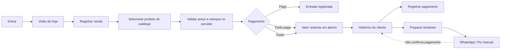

# Sem Caderno

> Vendas, fiados e despesas sem papel e sem confusão.

[English version](README.en.md)

Sem Caderno é um MVP web para pequenos comércios brasileiros que ainda controlam o dia a dia em
cadernos, folhas soltas ou pela memória. Ele organiza vendas, valores fiados, pagamentos e despesas
sem obrigar o comerciante a aprender termos de contabilidade ou a operar um ERP.

O produto foi pensado para o balcão: poucos passos, linguagem cotidiana, boa leitura em celular e
um histórico financeiro que não apaga silenciosamente o que aconteceu.

## O problema que resolve

No fim do dia, o comerciante precisa responder perguntas simples:

- Quanto entrou hoje?
- Quanto saiu hoje?
- Quanto sobrou?
- Quem está devendo?
- Essa pessoa já pagou alguma parte?

O Sem Caderno transforma essas perguntas na navegação do produto. “Quem está devendo” substitui
“contas a receber”; “quanto entrou” substitui “receita bruta”; e cobranças por WhatsApp/Pix continuam
sob controle humano.

## O que já funciona

- criação de conta e estabelecimento;
- entrada e saída segura da conta;
- painel com entradas, saídas, saldo simples e total em aberto;
- cadastro e edição de clientes e produtos;
- bloqueio de produtos repetidos e de WhatsApp duplicado por estabelecimento;
- preços em reais com máscara automática, sem exigir ponto ou vírgula;
- estoque simples por produto, com baixa atômica na venda e devolução no cancelamento;
- venda paga, parcialmente paga ou fiada;
- busca com sugestões que aceita somente produtos ativos, disponíveis e cadastrados;
- preço da venda resolvido pelo servidor a partir do catálogo, sem confiar no navegador;
- histórico de compras por cliente;
- pagamentos posteriores, parciais ou completos;
- bloqueio de pagamento maior que a dívida;
- registro de despesas;
- preparação de lembrete por WhatsApp com chave Pix opcional;
- separação explícita entre “lembrete enviado” e “pagamento recebido”;
- atividade financeira auditável e cancelamento sem apagar o passado;
- tutorial de primeiro acesso;
- dados de demonstração realistas;
- interface responsiva para computador, tablet e celular.

## Demonstração em dois minutos

Pré-requisitos: Node.js `24.19.x` e Corepack/pnpm `11.20.x`.

```bash
pnpm install --frozen-lockfile
pnpm dev:api
```

Em outro terminal:

```bash
pnpm dev:web
```

Abra [http://localhost:3000](http://localhost:3000). A demonstração não exige banco de dados:

- e-mail: `demo@semcaderno.app`
- senha: `semcaderno`

O modo demonstração usa memória e volta aos dados iniciais quando a API reinicia. Ele existe para
revisão rápida do portfólio; não é apresentado como armazenamento de produção.

## Executar com dados persistentes

A forma mais simples de testar o caminho de produção é pelo Docker Compose. Ele inicia PostgreSQL
18, executa as migrações, inicia a API e publica a interface.

```bash
docker compose up --build
```

Depois, acesse [http://localhost:3000](http://localhost:3000), escolha **Ainda não tenho conta** e
crie seu próprio estabelecimento. Os dados permanecem no volume `sem-caderno-data`.

Para encerrar:

```bash
docker compose down
```

Para apagar também o banco local de teste:

```bash
docker compose down -v
```

Essa última operação é destrutiva e deve ser usada somente quando você realmente quiser remover os
dados locais.

## Configuração sem Docker

Copie `.env.example` para `.env`, ajuste `DATABASE_URL` e execute:

```bash
pnpm install --frozen-lockfile
pnpm build
pnpm --filter @sem-caderno/database-migrations migrate
pnpm --filter @sem-caderno/server start
pnpm --filter @sem-caderno/web start
```

Variáveis principais:

| Variável                     | Finalidade                                                   |
| ---------------------------- | ------------------------------------------------------------ |
| `DATABASE_URL`               | conexão PostgreSQL; obrigatória quando `NODE_ENV=production` |
| `SEM_CADERNO_WEB_ORIGIN`     | origem exata autorizada pela API                             |
| `SEM_CADERNO_SECURE_COOKIES` | mantenha `true` em HTTPS; o Compose local usa `false`        |
| `SEM_CADERNO_DATABASE_SSL`   | use `require` quando o provedor exigir TLS no PostgreSQL     |
| `NEXT_PUBLIC_API_URL`        | endereço público da API usado pelo navegador                 |

Segredos e arquivos `.env` não são versionados.

## Fluxo principal



## Arquitetura

O repositório é um monorepo TypeScript organizado como monólito modular:

```text
apps/web                     Next.js + React; experiência do comerciante
apps/server                  Fastify; HTTP, sessão, CSRF e composição
packages/contracts           contratos e schemas estáveis
packages/application         casos de uso e portas de aplicação
packages/domain              regras independentes de framework
packages/persistence-postgres adaptadores PostgreSQL
tools/database               migrações ordenadas e verificadas por checksum
docs                         visão, ADRs, segurança, UX e especificações
```

O navegador nunca escolhe o estabelecimento que autoriza uma operação. A API resolve o contexto a
partir da sessão e toda consulta de negócio inclui esse limite. Valores monetários são inteiros em
centavos; não há `float` como fonte de verdade.

### Dois perfis de execução

| Perfil       | Uso                                            | Persistência                                                             |
| ------------ | ---------------------------------------------- | ------------------------------------------------------------------------ |
| Demonstração | avaliação rápida, vídeo e revisão do portfólio | memória; dados reiniciáveis e identificados na tela                      |
| PostgreSQL   | uso real do MVP e implantação                  | PostgreSQL 18 com migrações, transações e isolamento por estabelecimento |

Produção falha de forma segura quando `DATABASE_URL` não existe. A aplicação não cai
silenciosamente para o modo demonstração em ambiente de produção.

## Decisões de engenharia que importam

### Dinheiro confiável

- BRL é armazenado em centavos inteiros.
- Dívida é derivada de venda e pagamentos; não é um saldo editável.
- Venda com valor em aberto exige cliente.
- Pagamentos não podem ultrapassar o restante da venda.
- Cancelamentos preservam o registro original e exigem motivo.
- A API, e não o navegador, define nome e preço do produto vendido.
- A baixa de estoque ocorre na mesma transação da venda; cancelamento repõe as unidades.

### Operações seguras

- Mutações financeiras recebem chave de idempotência.
- A mesma intenção pode ser repetida sem duplicar registros.
- A mesma chave com dados diferentes é rejeitada.
- Escritas relacionadas ocorrem em uma transação no PostgreSQL.
- Restrições únicas no banco reforçam a proteção contra produto e WhatsApp duplicados.
- Atividades registram o resultado em linguagem compreensível.

### Autenticação e proteção web

- senhas usam Argon2id;
- tokens de sessão são aleatórios e o token de autenticação é persistido como digest;
- cookies são `HttpOnly`, `SameSite=Strict` e `Secure` em HTTPS;
- mutações exigem proteção CSRF de dupla apresentação;
- entrada tem limitação de tentativas;
- corpos, prazos e parâmetros HTTP têm limites;
- respostas recebem cabeçalhos contra interpretação de conteúdo, enquadramento e vazamento de
  referência;
- erros públicos não expõem stack trace, SQL ou segredo.

## O que veio dos projetos de IA aplicada

Sem Caderno não recebeu um chatbot nem uma função de IA sem necessidade. O que foi aproveitado foi
a disciplina de engenharia demonstrada nos quatro projetos anteriores:

- **Policy Engine:** resultados explicáveis, estado degradado explícito e linguagem de confiança;
- **Project Bridge:** contratos tipados, idempotência, fronteiras de permissão e autoridade humana;
- **Agent Eval:** casos dourados, testes de regressão e critérios verificáveis;
- **Incident Room:** histórico auditável, limites operacionais e recuperação segura.

Isso mostra uma decisão importante de produto: saber aplicar técnicas modernas também significa
saber quando **não** usar um modelo de IA.

## Qualidade e validação

```bash
pnpm validate
```

O gate completo verifica:

- runtime fixado;
- documentação e links;
- formatação e lint;
- TypeScript estrito;
- regras de dependência entre camadas;
- contratos e casos de uso;
- API e segurança de sessão;
- regras do MVP, incluindo fiado, pagamento excessivo, catálogo, estoque, duplicidade, lembrete sem
  baixa e idempotência;
- adaptadores PostgreSQL em banco real quando a infraestrutura de teste está disponível;
- build de todos os pacotes, API, migrações e interface;
- ordem e checksum das migrações.

A integração contínua executa os mesmos gates; os testes de persistência criam instâncias isoladas
de PostgreSQL em contêineres descartáveis.

## Limites conscientes do MVP

Não fazem parte desta versão:

- emissão de nota fiscal;
- contabilidade, DRE ou conciliação bancária;
- baixa automática de Pix;
- compras, fornecedores, lotes e estoque complexo;
- iFood, cozinha, mesas, impressora ou fidelidade;
- envio automático de WhatsApp;
- aplicativo móvel nativo;
- inteligência artificial;
- equipes com permissões administrativas avançadas.

O recorte é intencional: validar o valor do caderno digital antes de crescer para um ERP.

## Documentação técnica

- [Visão do produto](docs/product/vision.md)
- [Escopo do MVP](docs/product/mvp-scope.md)
- [Princípios de UX](docs/product/ux-principles.md)
- [Especificação da entrega executável](docs/specs/mvp-release-implementation.md)
- [Arquitetura](docs/architecture/architecture.md)
- [Decisões arquiteturais](docs/architecture/decisions/README.md)
- [Decisão sobre envio direto por WhatsApp](docs/architecture/decisions/0036-whatsapp-direct-delivery.md)
- [Privacidade e LGPD](docs/security/privacy-and-lgpd.md)
- [Estratégia de testes](docs/quality/test-strategy.md)

## Uso do projeto

Este é um projeto de portfólio. A definição de uma licença pública permanece uma decisão explícita
do autor antes de aceitar reutilização externa.
